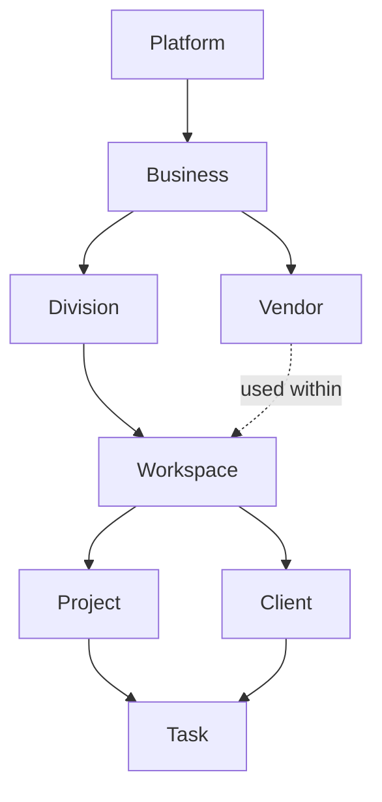

# RIVA OS Information Architecture

**Status:** Canonical source of truth (Project 058)  
**Scope:** Long-term navigation, hierarchy, and terminology for RIVA OS  
**Not in scope:** Feature implementation, UI redesign, route changes

**Supersedes for OS product language:** informal “CRM dashboard” framing  
**Related (historical / technical):**  
[`docs/product/03_INFORMATION_ARCHITECTURE.md`](./product/03_INFORMATION_ARCHITECTURE.md) ·  
[`docs/product/09_NAMING_GUIDE.md`](./product/09_NAMING_GUIDE.md) ·  
[`docs/architecture/03_COMPANY_HIERARCHY.md`](./architecture/03_COMPANY_HIERARCHY.md)

---

## 1. Purpose

RIVA is an **operating system for event and creative businesses**, not a traditional CRM.

This document defines:

1. The complete **user journey** into work
2. The canonical **entity hierarchy**
3. **Navigation rules** (before vs after Workspace)
4. A **naming review** with recommended enterprise terms
5. **Future expansion** constraints the architecture must support

All future navigation, permissions, data scoping, and module work must map to this IA.

---

## 2. User Journey

### 2.1 Canonical flow

```text
Login
  ↓
Welcome
  ↓
Business
  ↓
Division          ← skip when zero or one Division
  ↓
Workspace
  ↓
Modules
```

### 2.2 Step definitions

| Step | Purpose | User sees | User does not see |
| --- | --- | --- | --- |
| **Login** | Authenticate identity | Auth only | Sidebar, modules, business data |
| **Welcome** | Orient; first calm impression | Greeting + single Continue | Sidebar, CRM, pickers |
| **Business** | Choose the organization to work in | Business picker | Sidebar, modules |
| **Division** | Choose the operational line (if required) | Division picker | Sidebar, modules |
| **Workspace** | Enter the active working context | App chrome + sidebar | Onboarding-only screens as home |
| **Modules** | Perform day-to-day work | Module routes (Projects, Clients, …) | Entry flow unless switching context |

### 2.3 Progressive disclosure

Show **only what is required** at each step.

- One primary action per entry screen
- Division is omitted when not applicable (none or a single Division)
- Modules never appear before Workspace context is established

### 2.4 Context persistence

After Business (+ Division when applicable) are selected:

- Persist **active Business**
- Persist **active Division** (when modeled)
- Persist **active Workspace** context for the session (and preferably across sessions as last-used preference)

Deep links into modules may skip Welcome when context is already complete and authorized; incomplete context always returns to the entry flow at the missing step.

---

## 3. Entity Hierarchy

### 3.1 Master hierarchy (canonical)

```text
Platform
  └── Business                         (tenant / organization)
        └── Division                   (operational line)
              └── Workspace            (active working context)
                    ├── Project
                    ├── Client
                    ├── Task
                    ├── Vendor*        (Business-scoped; visible in Workspace)
                    └── Modules…       (Meetings, Documents, Finance, …)
```

\* Vendors belong to the **Business** (shared catalog). They are used inside Workspace modules but are not children of a single Project.



### 3.2 Entity definitions

#### Business

**What it is:** The commercial organization the user works for — the primary tenant boundary.

**Examples:**

- Ruyan Events  
- Photography  
- Candle  
- Event Space  
- RIVA  

**Owns:**

- Divisions  
- People / memberships (at Business scope)  
- Vendor directory  
- Brand defaults (timezone, locale, currency, logo)  
- Isolation boundary from other Businesses  

**Rule:** Data from Business A is never visible in Business B unless an explicit cross-business capability is designed later.

---

#### Division

**What it is:** An operational line of business inside a Business.

**Examples:**

- Weddings  
- Corporate  
- Private Events  
- Festival  

**Owns / scopes:**

- Division membership (subset of Business people)  
- Pipelines, templates, and defaults for that line  
- Workspace contexts under that Division  

**Rules:**

- A Business may have zero, one, or many Divisions  
- If **zero or one** Division exists, the Division step is **skipped**  
- Divisions are structural, not marketing labels

---

#### Workspace

**What it is:** The **active working context** after Business + Division (when required) are selected.

Workspace is where the sidebar appears and modules load. It is the operator’s “desk” inside the chosen Business/Division — not a third tenant and not a client-facing portal.

**Contains:**

- Module navigation (sidebar)  
- Access to Projects, Clients, Tasks, Vendors, and other modules scoped to the active context  
- Persisted active context for the session  

**Does not contain:**

- Cross-Business browsing without an explicit switch back through Business (and Division) selection  

---

#### Project

**What it is:** A client engagement or job inside a Workspace.

**Belongs to:** Workspace (under Business / Division)  
**Typically linked to:** one or more Clients  

Examples: a wedding production, a corporate event, a shoot package.

---

#### Client

**What it is:** A customer / account record.

**Belongs to:** Business / Division (scoped; surfaced in Workspace)  

Clients are CRM entities of the Business, filtered by active Division when Divisions exist.

---

#### Task

**What it is:** An actionable work item.

**Belongs to:** Project **or** Client (and always within Workspace context)  

Tasks must not float unscoped at Platform level.

---

#### Vendor

**What it is:** A supplier or partner used to deliver work.

**Belongs to:** Business  

Vendors are shared across Divisions/Workspaces of that Business unless a future Division-scoped vendor policy is introduced.

---

### 3.3 Mapping to current implementation (reference only)

This section documents **today’s code/storage names** so engineers can migrate language without inventing a second hierarchy. It does **not** redefine the canonical IA above.

| Canonical (OS) | Current code / DB (approx.) | Notes |
| --- | --- | --- |
| **Business** | `Company` | OS Business Picker selects a company |
| **Division** | Not modeled yet | Picker skipped until Business Unit exists |
| **Workspace** (active context) | Session after company cookies + dashboard chrome | Product “Workspace” ≠ historical `workspaces` row alone |
| **Legacy `Workspace` table** | Multi-company container in early schema | Treat as transitional infrastructure; do not use “Workspace” in UI for this row when it conflicts with OS meaning |
| **Project / Client / Task / Vendor** | Matching modules | Preserve; scope under active Business (+ Division later) |

**Migration principle:** Product and UI language follow this document. Storage identifiers may lag; new tables and APIs should prefer canonical names (`business`, `division`) or explicit aliases.

---

## 4. Navigation Rules

### 4.1 Before Workspace

**Allowed**

- Login  
- Welcome  
- Business Picker  
- Division Picker (when required)  
- Minimal account actions (e.g. sign out)  
- Setup paths required to obtain a Business (e.g. create company/workspace bootstrap)

**Forbidden**

- Sidebar  
- CRM / delivery modules  
- Dashboard widgets as the post-login home  
- Workspace / Company switchers in chrome (hidden until a deliberate context-switch UX returns)

**Principle:** Onboarding only. Calm. One decision at a time.

### 4.2 After Workspace

**Required**

- Load sidebar  
- Load modules for the active Business (+ Division)  
- Persist active context  
- Scope all list/detail queries to that context  

**Allowed**

- Module navigation (Projects, Clients, Vendors, Tasks, Settings, …)  
- In-module flows (create/edit/detail)  
- Future context switch that returns the user through Business / Division selection (or an equivalent progressive switcher)

**Forbidden**

- Loading delivery data without resolved Business context  
- Mixing data across Businesses in one view  

### 4.3 Context stack

Every authenticated operator session carries:

```text
User
  → Active Business          (required)
  → Active Division          (required when Business has 2+ Divisions)
  → Active Workspace         (implied once chrome loads)
  → Active Module / Record   (route)
```

### 4.4 Switching context

Changing Business or Division is a **first-class context change**, not a silent filter.

Recommended behavior:

1. User initiates switch  
2. Return to Business (and Division if needed) selection — or a dedicated switcher that enforces the same rules  
3. Reload Workspace with the new context  
4. Do not leave previous Business data mounted in the UI

---

## 5. Naming Review

### 5.1 Product name

| Context | Use |
| --- | --- |
| Product | **RIVA OS** |
| Short | **RIVA** |
| Avoid | Framing the product as “CRM”, “admin panel”, or dual brands |

### 5.2 Canonical vs avoid

| Concept | Canonical term | Avoid | Why |
| --- | --- | --- | --- |
| Tenant organization | **Business** | Company (in UI), Org, Tenant (in UI), Account | “Business” matches operator language; “Company” remains acceptable in legal/billing copy |
| Operational line | **Division** | Squad, Tribe, Team (as hierarchy), Unit (alone) | Clear enterprise term; maps to historical “Business Unit” |
| Active working shell | **Workspace** | Dashboard (as the OS), Home (ambiguous), Command Center (as IA term) | Workspace = where work happens after context is set |
| Engagement / job | **Project** | Job bag, Deal (unless sales-specific module) | Stable across wedding/corporate/studio |
| Customer record | **Client** | Customer (OK synonym), Lead (pipeline stage only) | Consistent with existing modules |
| Work item | **Task** | To-do (UI microcopy OK), Ticket | Keep entity name Task |
| Supplier | **Vendor** | Partner (unless role), Supplier (OK synonym) | Matches module |
| Operator | **Agent** / **Member** | User (too generic in product copy) | Prefer role-specific where possible |
| Customer-facing surface | **Client Portal** | App, Love portal | Keep functional |
| Operator surface | **Agent Portal** / **RIVA OS** | Cockpit, Command Deck | Prefer RIVA OS in UX |

### 5.3 Historical term reconciliation

| Older bible / docs term | OS canonical | Guidance |
| --- | --- | --- |
| Company | **Business** | Prefer Business in UX and new docs; “Company” OK for legal entity records |
| Business Unit | **Division** | Prefer Division in UX; “Business Unit” OK in formal architecture appendices |
| Client Workspace | **Project** (engagement) + **Workspace** (operator context) | Do not overload “Workspace” to mean a single client engagement |
| Agent Portal | **RIVA OS** (product) / modules after Workspace | Align marketing and IA over time |

### 5.4 Recommended enterprise glossary (locked)

| Term | Definition (one line) |
| --- | --- |
| **Platform** | RIVA multi-tenant product plane |
| **Business** | Organization tenant |
| **Division** | Operational line inside a Business |
| **Workspace** | Active operator context after Business (+ Division) |
| **Module** | Capability area inside Workspace (Projects, Clients, …) |
| **Project** | Client engagement / job |
| **Client** | Customer account |
| **Task** | Actionable work item |
| **Vendor** | Supplier / partner of the Business |
| **Legal Entity** | Registered company record (future; may attach to Business) |
| **Brand** | Market-facing identity (future; may attach to Business or Division) |

### 5.5 UI copy rules

- Prefer **Choose Business** / **Choose Division**, not “Select company/workspace”  
- Prefer **Continue** as the single primary entry CTA  
- Prefer **Workspace** only after context is set  
- Do not label the post-login Welcome as a Dashboard  

---

## 6. Future Expansion

The IA must support growth **without breaking** the entry journey or tenant isolation.

### 6.1 Multiplicity

| Capability | Rule |
| --- | --- |
| **Multiple Businesses** | User may belong to many; must pick one before Workspace |
| **Multiple Divisions** | Per Business; picker when count > 1; skip when ≤ 1 |
| **Multiple Legal Entities** | Attach under Business (or as Business attributes); never replace Business as the UX tenant picker without an IA revision |
| **Multiple Brands** | Attach to Business or Division; branding affects presentation, not the Login → Workspace journey |
| **Multiple Countries** | Locale/currency/timezone and regional compliance scoped to Business (or Legal Entity); context stack unchanged |

### 6.2 Role-based permissions

Permissions resolve against the context stack:

```text
Platform role (rare)
  → Business role
    → Division role (optional refinement)
      → Module / record permissions
```

Rules:

- No module data without Business context  
- Division-scoped roles may further restrict Projects/Clients  
- Platform Super Admin is outside normal Business entry (separate surface)

### 6.3 Extensibility constraints

Future features must:

1. Declare which **entity** they hang from (Business, Division, Workspace, Project, …)  
2. Declare whether they appear **before** or **after** Workspace  
3. Avoid introducing a parallel hierarchy (e.g. a second “org picker”)  
4. Keep entry flow: Login → Welcome → Business → Division → Workspace → Modules  

### 6.4 Non-goals (explicit)

- Replacing this hierarchy with a flat “all companies in one sidebar” model  
- Loading CRM modules during Welcome / Business / Division  
- Using “Dashboard” as the name of the OS entry experience  

---

## 7. Module placement (after Workspace)

Modules load only inside Workspace. Initial set (illustrative; not a feature commitment):

| Module | Primary parent scope |
| --- | --- |
| Projects | Workspace / Division |
| Clients | Business / Division |
| Vendors | Business |
| Tasks | Project or Client |
| Meetings | Workspace (linked to Project/Client as needed) |
| Documents | Workspace / Project |
| Finance | Business / Project |
| Settings | Business (and user preferences) |

Sidebar contents may vary by Business type or enabled modules, but **placement rules** above remain fixed.

---

## 8. Decision log

| Decision | Choice | Rationale |
| --- | --- | --- |
| Product framing | Operating system, not CRM | Calm, progressive, context-first |
| UX tenant name | **Business** | Matches picker copy and operator language |
| Operational split | **Division** | Clear; skippable when ≤ 1 |
| Post-context shell | **Workspace** | Sidebar + modules live here |
| Vendor ownership | **Business** | Shared supplier catalog |
| Task ownership | **Project or Client** | Flexible without Platform-level orphans |

---

## 9. Definition of done (for this document)

- [x] Complete user journey documented  
- [x] Entity hierarchy defined with examples  
- [x] Navigation rules before/after Workspace  
- [x] Naming review + recommended glossary  
- [x] Future expansion (multi-business, division, legal entity, brand, country, RBAC)  

**This file is the source of truth for RIVA OS information architecture.**  
Implementation work (schema renames, Division model, switchers) must reference this document and land in separate projects.
