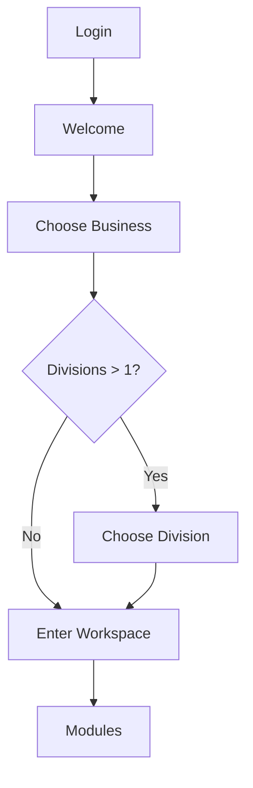
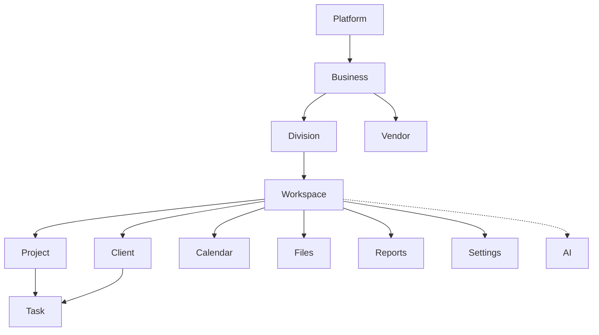
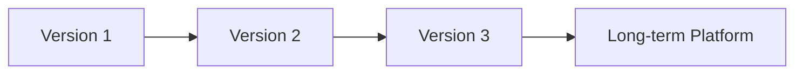

# RIVA OS Product Bible

**Version:** 1.0  
**Status:** Official product specification — single source of truth  
**Audience:** Product managers, designers, developers, stakeholders, AI coding assistants  
**Scope:** Product architecture, philosophy, modules, navigation, permissions, design language, roadmap  

**Not in scope:** Implementation details, database schemas, API contracts, route maps, UI code changes

**Companion:** [`RIVA_OS_INFORMATION_ARCHITECTURE.md`](./RIVA_OS_INFORMATION_ARCHITECTURE.md)

---

## Document control

| Field | Value |
| --- | --- |
| Product | RIVA OS |
| Classification | Business Operating System |
| Authority | This bible governs all future product decisions |
| Conflict rule | If older docs disagree with this bible on product language or journey, **this document wins** |
| Change rule | Material changes require an explicit version bump and decision log entry |

---

# 1. Vision

## 1.1 What is RIVA OS?

**RIVA OS is a Business Operating System** for service and creative companies — especially events, weddings, studios, venues, and related hospitality brands.

It is **not** a traditional CRM.

A traditional CRM optimizes contact records, pipelines, and sales activity. RIVA OS optimizes **how a business runs**: choosing context, coordinating people, delivering client work, managing suppliers, and — over time — finance, operations, and intelligence.

RIVA OS is the calm desk from which an organization operates.

Operators enter through a progressive journey, select where they work, then use modules inside a focused Workspace. Clients will eventually experience progress through a separate Client Portal. Automation and AI amplify the system after the operating model is solid.

## 1.2 Vision statement

> **RIVA OS gives every business one place to run: clear context, focused modules, trusted records, and room to grow — without the noise of a generic admin dashboard.**

## 1.3 Product philosophy

| Pillar | Meaning |
| --- | --- |
| **Operating system, not CRM** | Context and workflow first; contacts are one module, not the product identity |
| **Context before function** | Users choose Business (and Division) before tools appear |
| **Progressive disclosure** | Show only what is needed for the next decision |
| **Two surfaces, one spine** | Operator OS and Client Portal share data; they never share chrome |
| **Hierarchy is sacred** | Features hang from Platform → Business → Division → Workspace → Modules |
| **Calm premium craft** | Enterprise strength with Apple-level restraint |
| **Invitation before open growth** | Controlled access first; public self-serve later |
| **Intelligence last, not first** | AI assists after records, workflows, and portals exist |

## 1.4 Who it is for

| Audience | Relationship to RIVA OS |
| --- | --- |
| **Business owners & admins** | Configure Business, Divisions, people, permissions |
| **Managers** | Oversee delivery, clients, vendors, schedules |
| **Staff / agents** | Execute projects, tasks, meetings, files day to day |
| **Guests** | Limited or read-oriented access when invited |
| **Clients** (future portal) | Experience progress outside the operator OS |
| **Vendors** (future) | Participate in delivery without full OS access |

## 1.5 What RIVA OS is not

- Not a sales-only CRM  
- Not a generic project board with a login screen  
- Not a dense multi-widget “command dashboard” as the first impression  
- Not a mixed agent/client interface in one shell  

---

# 2. Design Principles

These principles are **binding**. Features that violate them must be redesigned before build.

## 2.1 Minimalist

Remove everything that does not serve the current decision or task. Prefer fewer screens, fewer controls, and less chrome. If an element does not improve understanding or action, it does not ship.

## 2.2 Calm

The product should lower cognitive load. Quiet surfaces, measured motion, and predictable patterns. Avoid urgency theater, alert spam, and visual noise.

## 2.3 Premium

Craft over decoration. Materials, typography, spacing, and interaction quality should feel considered and high-end — never cheap, flashy, or template-like.

## 2.4 Enterprise

Support real multi-business operations, roles, auditability, and long-term scale. Premium does not mean fragile; enterprise does not mean cluttered.

## 2.5 Apple-inspired

Clarity, hierarchy, and restraint. Large type where it matters, generous space, obvious primary actions, and interactions that feel inevitable. Inspiration is philosophical — not a visual clone.

## 2.6 Progressive Disclosure

Reveal complexity only when the user needs it. Entry flow before modules. Detail after overview. Advanced settings behind clear pathways.

## 2.7 One Primary Action Per Screen

Especially on entry and decision screens: one clear next step. Secondary actions, if any, remain visually subordinate or deferred.

## 2.8 Consistency Over Complexity

Reuse patterns across modules. Prefer one table pattern, one form pattern, one empty state language. Special cases must earn their existence.

## 2.9 Context Before Function

No delivery tools before Business (+ Division when required). Tools without context create wrong data and confused operators.

## 2.10 Supporting principles

| Principle | Explanation |
| --- | --- |
| **Hierarchy is sacred** | Do not invent parallel tenancy trees |
| **Workflow over screens** | States and handoffs before UI flourish |
| **Accessibility is quality** | Readable type, clear focus, reduced-motion respect |
| **Mobile and desktop parity in intent** | Same journey and concepts; layout adapts |

---

# 3. User Journey

## 3.1 Canonical flow

```text
Login
  ↓
Welcome
  ↓
Business
  ↓
Division          ← skipped when zero or one Division
  ↓
Workspace
  ↓
Modules
```



## 3.2 Journey stages

### Login

Authenticate the person. No Business data, no sidebar, no modules.

### Welcome

First impression of RIVA OS. Greeting, orientation, single **Continue**. Calm full-screen presence. No CRM.

### Business

User selects the organization to work in today (e.g. Ruyan Events, Photography, Candle, Event Space, RIVA). One decision.

### Division

If the Business has multiple operational lines (e.g. Weddings, Corporate, Private Events, Festival), user selects one. Otherwise skip.

### Workspace

Active working context loads. Sidebar appears. Context persists. This is where work begins.

### Modules

Operator uses Projects, Clients, Tasks, Calendar, Files, Reports, Settings, and future capabilities — all scoped to the active context.

## 3.3 Journey rules

1. Incomplete context returns the user to the missing step.  
2. Deep links into modules are allowed only when context is complete and authorized.  
3. Switching Business or Division is a deliberate context change, not a silent filter.  
4. The post-login home is **not** a widget dashboard; it is the OS entry journey (or Workspace after context is set).

---

# 4. Core Concepts

## 4.1 Hierarchy

```text
Platform
  └── Business
        └── Division
              └── Workspace
                    ├── Client
                    ├── Project
                    ├── Task
                    ├── Calendar
                    ├── Files
                    ├── Reports
                    ├── Settings
                    └── AI (assistive layer)
        └── Vendor          ← belongs to Business
```



## 4.2 Definitions and ownership

### Business

The organization tenant — the commercial identity a person works for.

**Examples:** Ruyan Events, Photography, Candle, Event Space, RIVA  

**Owns:** Divisions, people memberships, vendor directory, brand defaults, isolation boundary  

**Rule:** Business A never sees Business B data by default.

---

### Division

An operational line inside a Business.

**Examples:** Weddings, Corporate, Private Events, Festival  

**Owns / scopes:** Division membership, process defaults, Workspace contexts under that line  

**Rule:** Skip picker when zero or one Division exists.

---

### Workspace

The active operator context after Business (+ Division) are selected. Sidebar and modules live here.

**Owns:** The working session’s module access and scoped views  

**Is not:** A client-facing portal; not a substitute for Business

---

### Client

A customer or account record of the Business (optionally refined by Division).

**Belongs to:** Business / Division  
**Used in:** Workspace CRM and Project linkage  

---

### Vendor

A supplier or partner used to deliver work.

**Belongs to:** Business  
**Used in:** Workspace modules across Divisions unless later restricted  

---

### Project

A client engagement or job.

**Belongs to:** Workspace context under Business / Division  
**Typically linked to:** Client(s)  

---

### Task

An actionable work item.

**Belongs to:** Project or Client  
**Always within:** Active Workspace context  

---

### Calendar

Time-based view of meetings, milestones, and scheduled work.

**Belongs to:** Workspace (events may link to Project, Client, or Task)  

---

### Files

Documents and media for delivery and operations.

**Belongs to:** Workspace / Project / Client as appropriate  
**Business-level libraries** may exist for templates and standards  

---

### Reports

Operational and management insights.

**Belongs to:** Business (and Division filters)  
**Consumed in:** Workspace  

---

### Settings

Configuration for Business, Division, people, preferences, and module defaults.

**Belongs to:** Business (primary), user (personal preferences)  

---

### AI

Assistive intelligence across modules — drafting, summarizing, suggesting next actions.

**Belongs to:** No separate tenant; operates **within** authorized Business/Division/Workspace scope  
**Rule:** AI never bypasses permissions or invents a parallel data plane  

---

# 5. Product Modules

Modules appear **only after Workspace**. Descriptions below are product intent, not implementation commitments for every field or screen.

## 5.1 Foundation

| | |
| --- | --- |
| **Purpose** | Identity, invitation, Business/Division context, session persistence, audit basics |
| **Primary users** | Owners, Administrators, all authenticated operators |
| **Key responsibilities** | Login, Welcome, Business/Division selection, Workspace entry, secure access |
| **Future expansion** | Legal entities, brands, countries, SSO, advanced audit |

---

## 5.2 CRM

| | |
| --- | --- |
| **Purpose** | Manage Clients as durable business relationships |
| **Primary users** | Managers, Staff, Administrators |
| **Key responsibilities** | Client directory, profiles, status, notes/history linkage, association to Projects |
| **Future expansion** | Pipelines, segments, portal invites, relationship health |

---

## 5.3 Projects

| | |
| --- | --- |
| **Purpose** | Run client engagements and jobs end to end |
| **Primary users** | Managers, Staff |
| **Key responsibilities** | Project list/detail, ownership, status, linkage to Clients, delivery coordination |
| **Future expansion** | Templates by Division, milestones packs, portal publishing hooks |

---

## 5.4 Tasks

| | |
| --- | --- |
| **Purpose** | Track actionable work to completion |
| **Primary users** | Staff, Managers |
| **Key responsibilities** | Create/assign/complete tasks; attach to Project or Client; due dates and priority |
| **Future expansion** | Dependencies, checklists, automation triggers, workload views |

---

## 5.5 Calendar

| | |
| --- | --- |
| **Purpose** | Make time visible across people and engagements |
| **Primary users** | Managers, Staff |
| **Key responsibilities** | Schedule views, meetings/events, date-centric navigation into related records |
| **Future expansion** | Resource booking, multi-timezone teams, external calendar sync |

---

## 5.6 Files

| | |
| --- | --- |
| **Purpose** | Store and organize operational and delivery documents |
| **Primary users** | Staff, Managers, Administrators |
| **Key responsibilities** | Upload, organize, preview, attach to Project/Client, permission-aware access |
| **Future expansion** | Galleries, versioning, client-visible file sets, approval workflows |

---

## 5.7 Finance *(future)*

| | |
| --- | --- |
| **Purpose** | Manage money related to delivery and Business operations |
| **Primary users** | Owners, Administrators, Managers (finance-capable roles) |
| **Key responsibilities** | Quotes, invoices, payments, outstanding balances, project financial status |
| **Future expansion** | Multi-currency, tax regimes, payouts, profitability by Division |

---

## 5.8 Inventory *(future)*

| | |
| --- | --- |
| **Purpose** | Track physical or bookable assets used in delivery |
| **Primary users** | Managers, Staff (ops) |
| **Key responsibilities** | Catalog, availability, assignment to Projects/events |
| **Future expansion** | Maintenance, multi-location stock, vendor-linked supply |

---

## 5.9 HR *(future)*

| | |
| --- | --- |
| **Purpose** | People operations inside the Business |
| **Primary users** | Owners, Administrators, Managers |
| **Key responsibilities** | Team directory depth, roles, scheduling capacity, internal records |
| **Future expansion** | Time off, contractor modes, Division staffing plans |

---

## 5.10 Marketing *(future)*

| | |
| --- | --- |
| **Purpose** | Business development and brand campaigns adjacent to delivery |
| **Primary users** | Managers, Administrators |
| **Key responsibilities** | Campaigns, lead capture handoff into CRM, brand asset usage |
| **Future expansion** | Multi-brand campaigns, portal growth loops |

---

## 5.11 AI Assistant *(future)*

| | |
| --- | --- |
| **Purpose** | Accelerate operator work with scoped assistance |
| **Primary users** | All roles with module access |
| **Key responsibilities** | Drafting, summarization, suggested next actions, search assistance |
| **Future expansion** | Workflow agents, client-facing assist (portal), automation co-pilot |

**Constraint:** AI is a layer over modules — not a replacement for hierarchy, permissions, or system of record.

---

## 5.12 Reports

| | |
| --- | --- |
| **Purpose** | Provide clarity on performance and workload |
| **Primary users** | Owners, Administrators, Managers |
| **Key responsibilities** | Operational summaries, filters by Division/Project, export-ready views |
| **Future expansion** | Executive dashboards, benchmarking, scheduled digests |

---

## 5.13 Administration

| | |
| --- | --- |
| **Purpose** | Govern the Business safely |
| **Primary users** | Owners, Administrators |
| **Key responsibilities** | People & invitations, roles, Business profile, Division setup, module enablement, security preferences |
| **Future expansion** | Legal entities, brands, countries, compliance packs, billing |

---

# 6. Navigation Rules

## 6.1 Before Workspace

**Allowed**

- Login  
- Welcome  
- Business Picker  
- Division Picker (when required)  
- Sign out / essential account recovery paths  
- Minimal setup required to obtain a Business  

**Forbidden**

- Sidebar  
- CRM and delivery modules  
- Dense dashboard widgets as the landing experience  
- Browsing cross-Business data  

**Principle:** Onboarding only. One decision at a time.

## 6.2 After Workspace

**Required**

- Sidebar loads  
- Modules available per permissions and Business configuration  
- Active Business (+ Division) context persists  
- All lists and details scoped to that context  

**Allowed**

- Full module navigation  
- Record create/edit/detail flows  
- Deliberate context switch UX that re-establishes Business/Division  

**Forbidden**

- Mixing Business data in one view  
- Loading delivery data without resolved Business context  

## 6.3 Context stack

```text
User
  → Business                 (required)
  → Division                 (required when count > 1)
  → Workspace                (active shell)
  → Module / Record          (route intent)
```

## 6.4 Navigation quality bar

- Predictable back/forward mental model  
- Clear “where am I?” indicators (Business name, module name)  
- No dead ends without a path to Continue or return  

---

# 7. Permission Philosophy

## 7.1 Principles

1. **Least privilege** — grant only what the role needs.  
2. **Scope-aware** — permissions resolve inside Business (and Division when present).  
3. **Role-based** — capabilities attach to roles, not ad-hoc one-off flags as the default model.  
4. **Separation of surfaces** — Client Portal access is not Agent OS access.  
5. **Auditability** — sensitive admin and data changes should be attributable.  

## 7.2 Example roles

| Role | Intent |
| --- | --- |
| **Owner** | Full control of the Business; billing/governance (when applicable); can manage Administrators |
| **Administrator** | Configure Business, Divisions, people, roles, module settings; broad operational access |
| **Manager** | Oversee delivery across Projects/Clients; assign work; limited admin |
| **Staff** | Execute day-to-day module work within assigned scope |
| **Guest** | Narrow, often read-only or time-bounded access |

Exact capability matrices evolve by version; role *names* and *philosophy* above are stable.

## 7.3 Scope model

```text
Platform role (rare Super Admin)
  → Business role
    → Division role refinement (optional)
      → Module / record permissions
```

## 7.4 Permission rules of thumb

- No module data without Business context  
- Division roles may narrow what Staff see  
- Guests never inherit Owner/Administrator powers by convenience  
- AI inherits the user’s permissions; it cannot escalate  

---

# 8. Design Language

Design language expresses the principles in Section 2. It guides visual and interaction systems without prescribing component libraries.

## 8.1 Typography

- Strong hierarchy: display → title → body → meta  
- Generous tracking restraint; prefer clarity over novelty  
- Comfortable line length; concise labels  
- Product voice: calm, precise, enterprise — not playful admin slang  

## 8.2 Spacing

- Large whitespace as a feature  
- Clear vertical rhythm between sections  
- Density is earned (tables may be denser; entry screens stay spacious)  

## 8.3 Buttons

- One primary button style for the main action  
- Secondary and tertiary visually quieter  
- Entry screens: large, rounded, singular primary CTA  
- Destructive actions require clear confirmation patterns  

## 8.4 Cards

- Default: **avoid cards** for decoration  
- Use card-like surfaces for **choice** (Business/Division pickers) or true interactive containers  
- Soft borders; no heavy shadows  

## 8.5 Tables

- Clean, scannable, consistent column patterns  
- Prefer filters and search over overloaded toolbars  
- Empty and loading states match Section 8.9–8.8  

## 8.6 Forms

- Short by default; progressive sections for complexity  
- Clear labels; helpful, not chatty validation  
- Save/Cancel (or equivalent) patterns consistent across modules  

## 8.7 Dialogs

- Use sparingly for confirmations and focused tasks  
- Do not bury primary workflows exclusively in stacked modals  
- Escape/cancel always available  

## 8.8 Loading

- Light, non-dramatic waiting states  
- Prefer skeleton or quiet progress over blocking spinners when possible  
- Never fake completion  

## 8.9 Empty States

- Explain what is missing in one short sentence  
- Offer a single clear next action when appropriate  
- No illustration clutter or multiple competing CTAs  

## 8.10 Animations

- Soft, purposeful: fade and slight upward motion (~180–220ms) between entry screens  
- Reinforce hierarchy; do not decorate endlessly  
- Respect reduced-motion preferences  

## 8.11 Dark Mode

- Primary OS atmosphere may be deep neutral dark for focus and premium feel  
- Maintain soft contrast; avoid neon accents and glow stacks  
- Borders remain subtle; text hierarchy does the work  

## 8.12 Light Mode

- Supported as a first-class experience over time  
- Same spacing, typography, and component rules  
- Light surfaces stay calm — not stark corporate blue templates  

## 8.13 Color

- Neutral foundation  
- Accent used sparingly for primary actions and status  
- No bright recreational palettes; no trend-driven purple/glow defaults  

---

# 9. Future Roadmap

Roadmap versions describe **product maturity**, not engineering sprint numbers.



## 9.1 Version 1 — Operating foundation

**Goal:** Make RIVA OS feel like an OS: entry, context, and core delivery modules.

- Login → Welcome → Business → Division → Workspace journey  
- Business context persistence  
- Core modules: Foundation, CRM (Clients), Projects, Tasks, essential Files/Calendar beginnings, Administration basics, Reports beginnings  
- Navigation rules enforced (no sidebar before Workspace)  
- Role model: Owner, Administrator, Manager, Staff, Guest (initial)  
- Invitation-oriented access  

**Success looks like:** Operators enter calmly, pick context, and run client work without CRM-dashboard chaos.

## 9.2 Version 2 — Depth and portals

**Goal:** Deepen delivery and open the client-facing surface.

- Division model fully productized  
- Stronger Calendar and Files  
- Finance foundations  
- Client Portal (separate surface)  
- Automation beginnings (reminders, handoffs)  
- Richer Reports  
- Multi-brand / multi-country readiness in Administration  

**Success looks like:** Agents operate; clients see progress; money and files are trustworthy.

## 9.3 Version 3 — Operations platform

**Goal:** Expand from delivery OS to fuller business operations.

- Inventory  
- HR depth  
- Marketing adjacency  
- AI Assistant as a scoped copilot  
- Advanced permissions and audit  
- Cross-Division portfolio insights  

**Success looks like:** RIVA OS runs more of the company without losing calm UX.

## 9.4 Long-term platform vision

**Goal:** RIVA as the default operating system for service businesses worldwide.

- Public SaaS growth after invitation-era excellence  
- Multiple Legal Entities and Brands under clear Business UX  
- Marketplace-class vendor collaboration  
- Automation-native workflows across portals  
- AI that compounds advantage without replacing hierarchy  
- Mobile experiences that mirror the same IA  
- Platform-level Super Admin for the RIVA operator  

**North star:** One spine. Two portals. Endless modules — always context-first.

---

# 10. Decision Log (v1.0)

| Decision | Choice | Rationale |
| --- | --- | --- |
| Product category | Business Operating System | Differentiates from CRM; matches journey |
| UX tenant name | Business | Operator language; picker clarity |
| Operational split | Division | Enterprise-clear; skippable when ≤ 1 |
| Post-context shell | Workspace | Sidebar + modules boundary |
| Vendor ownership | Business | Shared supplier catalog |
| Task ownership | Project or Client | Flexible without orphan tasks |
| AI placement | Assistive layer after core OS | Prevents AI-first architecture debt |
| Entry aesthetic | Calm, minimal, premium | First impression is product identity |

---

# 11. How to use this bible

| Role | Use |
| --- | --- |
| **Product** | Prioritize roadmap; reject principle violations |
| **Design** | Apply design language and journey rules |
| **Engineering** | Map features to concepts/modules; respect navigation rules |
| **AI assistants** | Treat this file as authoritative product intent before coding |

**When proposing a feature, answer:**

1. Which concept does it belong to?  
2. Does it appear before or after Workspace?  
3. Which module owns it?  
4. Which roles may use it?  
5. Which principles does it uphold?  

If any answer is unclear, the feature is not ready.

---

**End of RIVA OS Product Bible v1.0**
