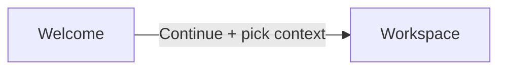
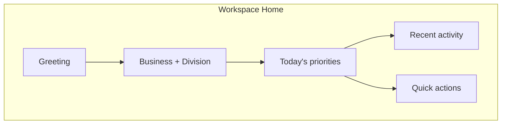
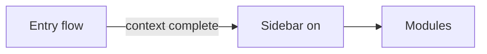
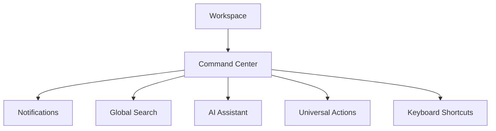
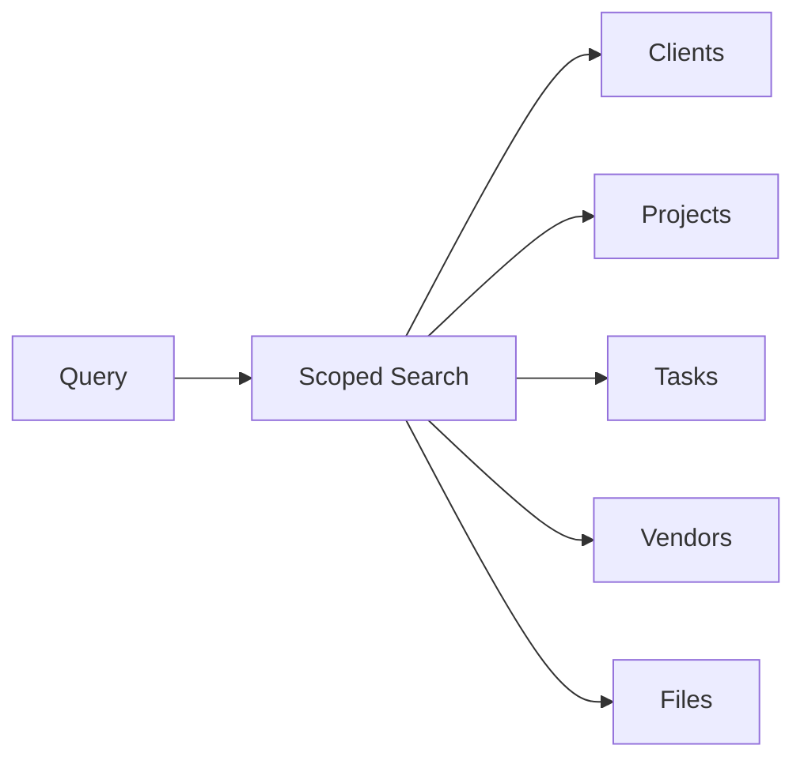
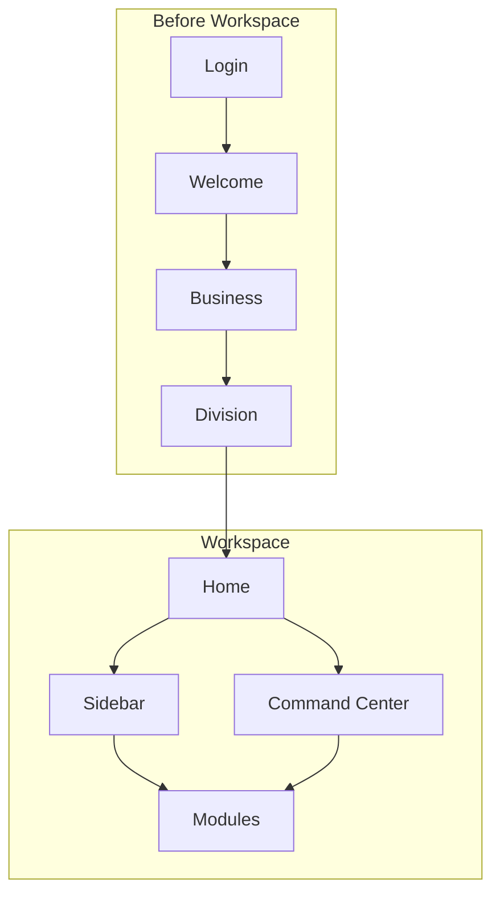

# RIVA OS Workspace Experience Specification

**Version:** 1.0  
**Status:** Canonical UX & product architecture for the post-context Workspace  
**Audience:** Product managers, designers, developers, AI coding assistants  
**Scope:** What users experience after Business → Division → Workspace is established  

**Not in scope:** Implementation details, UI code, routes, database schemas, API contracts

**Companions:**  
[`RIVA_OS_PRODUCT_BIBLE.md`](./RIVA_OS_PRODUCT_BIBLE.md) ·  
[`RIVA_OS_INFORMATION_ARCHITECTURE.md`](./RIVA_OS_INFORMATION_ARCHITECTURE.md)

---

## Document control

| Field | Value |
| --- | --- |
| Product surface | Operator Workspace (after context selection) |
| Authority | Guides all future Workspace home, sidebar, Command Center, search, and AI entry work |
| Conflict rule | Journey and naming follow the Product Bible; this document owns Workspace *experience* detail |
| Prerequisite | Business selected; Division selected when required |

---

# 1. Workspace Philosophy

## 1.1 What a Workspace represents

A **Workspace** is the operator’s active working context inside RIVA OS.

It is the desk that appears only after the user has chosen:

```text
Business
  → Division   (when required)
  → Workspace
```

Workspace is not a tenant. It is not a client portal. It is not the Welcome screen.

Workspace means: *“I know where I am working, and I am ready to operate.”*

Within Workspace, modules (CRM, Projects, Tasks, Calendar, Files, Reports, Settings, and future capabilities) become available, scoped to the active Business and Division.

## 1.2 Why Workspace is the operational home

| Reason | Explanation |
| --- | --- |
| **Context is resolved** | Data shown here belongs to the chosen Business (+ Division) |
| **Tools are legitimate** | Sidebar and modules only make sense after context exists |
| **Work continues** | Priorities, activity, and search resume from the last meaningful state |
| **Identity of place** | Operators return here daily — not to Login, not to Welcome |

Welcome orients. Workspace **operates**.

## 1.3 Welcome vs Workspace



| | Welcome | Workspace |
| --- | --- | --- |
| **Moment** | Entry / orientation | Daily operations |
| **Goal** | Calm first impression; one Continue | Focused work across modules |
| **Chrome** | No sidebar | Sidebar present |
| **Content** | Greeting + single CTA | Home overview + navigation + modules |
| **Data** | None (or identity only) | Scoped Business / Division data |
| **Feeling** | Arrival | At the desk |

**Rule:** Never treat Welcome as a dashboard. Never treat Workspace home as another onboarding screen.

---

# 2. First Impression

## 2.1 The first five seconds

Within five seconds of entering Workspace, the user should feel:

| Feeling | How the product earns it |
| --- | --- |
| **Calm** | Quiet surface, restrained motion, no alert theater |
| **Focused** | Clear “where am I?” (Business / Division) and a small set of priorities |
| **Premium** | Typographic hierarchy, generous space, polished emptiness |
| **Minimal** | Few regions, one primary path into work, no widget walls |
| **Enterprise-grade** | Obvious context, trustworthy structure, no toy patterns |

## 2.2 What must be instantly clear

1. Which **Business** is active  
2. Which **Division** is active (when applicable)  
3. That this is the **Workspace home**, not a random module  
4. What deserves attention **today** (if anything)  
5. How to reach the next useful action (sidebar, search, or a single primary quick action)

## 2.3 What must not happen in the first five seconds

- Modal stacks or forced tours  
- Dense KPI grids competing for attention  
- Unrelated cross-Business content  
- Multiple equally loud CTAs  
- AI interrupting unsolicited  

---

# 3. Dashboard Philosophy

“Dashboard” in RIVA OS means **Workspace home** — a calm operational overview — not a traditional CRM command wall.

## 3.1 Purpose of Workspace home

Answer three questions quickly:

1. Where am I?  
2. What matters today?  
3. Where do I go next?

## 3.2 What belongs on Workspace home

```text
Workspace Home
├── Greeting
├── Context strip (Business · Division)
├── Today’s priorities
├── Recent activity
└── Quick actions (limited)
```



### Greeting

Time-aware, personal, short. Reinforces presence without repeating the full Welcome ritual.

### Current Business

Always visible. The active organization name is part of orientation, not a buried setting.

### Current Division

Visible when Divisions exist and one is active. Omitted when Division was skipped (zero or one).

### Today’s priorities

A short, ranked list of what deserves attention now — e.g. due tasks, today’s meetings, follow-ups. Quality over quantity. Prefer five or fewer items when possible.

### Recent activity

A compact feed of meaningful recent events in this Workspace context. See Section 8.

### Quick actions

A small set of high-value create/navigate actions. See Section 6.

## 3.3 What should NOT appear

| Do not include | Why |
| --- | --- |
| Full module clones | Home previews; modules own depth |
| Large multi-KPI financial walls (v1) | Noise; belongs in Reports/Finance later |
| Unscoped global company news | Breaks context purity |
| Multiple promotional banners | Violates calm / one-primary-action ethos |
| Onboarding checklists as permanent chrome | Entry belongs in Welcome / setup |
| Every notification inline | Notifications live in Command Center |
| Decorative cards without a job | Clutter |

## 3.4 Layout principles

- One composition, not a widget bazaar  
- Progressive density: priorities first, activity second  
- Mobile: single column, same information hierarchy  
- Desktop: spacious, not a stretched phone with extra junk  

---

# 4. Sidebar Philosophy

## 4.1 Why the sidebar exists

The sidebar is the **durable map** of the Workspace. It answers: *What can I work on here?*

It exists to provide stable orientation across modules — not to showcase every feature the platform may ever have.

## 4.2 When it appears

| Phase | Sidebar |
| --- | --- |
| Login / Welcome / Business / Division | **Hidden** |
| Workspace (home and modules) | **Visible** |



## 4.3 Primary navigation

Primary items are the daily operating modules for the active Business.

**Illustrative primary set (v1 intent):**

| Item | Role |
| --- | --- |
| Home | Workspace overview |
| Projects | Engagements / jobs |
| Clients | CRM directory |
| Tasks | Actionable work |
| Calendar | Time view |
| Files | Documents & media |
| Vendors | Business supplier catalog |

Primary nav should remain **short**. If an item is not needed weekly by most operators, it is not primary.

## 4.4 Secondary navigation

Secondary items support governance and insight — available, but quieter.

**Illustrative secondary set:**

| Item | Role |
| --- | --- |
| Reports | Insights |
| Settings / Administration | Configuration (role-gated) |

Secondary may live lower in the sidebar, in a separated group, or behind a clear “More” pattern if the primary list must stay lean.

## 4.5 Future scalability

| Strategy | Guidance |
| --- | --- |
| **Module enablement** | Businesses may enable/disable modules; sidebar reflects configuration |
| **Role filtering** | Items user cannot access do not appear (or appear disabled with clear reason — prefer hide) |
| **Division relevance** | Optional Division-specific defaults without fragmenting IA |
| **No infinite growth** | New modules must justify primary vs secondary placement |
| **Overflow** | Prefer grouped secondary over a 20-item scroll of equals |

## 4.6 Sidebar anti-patterns

- Icon museums with no labels  
- Equally weighted 15+ top-level modules  
- Nesting so deep that users lose place  
- Mixing Client Portal destinations into operator sidebar  
- Showing Business switcher as a noisy multi-control cluster (context switch is deliberate; see Product Bible)

---

# 5. Command Center

## 5.1 Concept

The **Command Center** is the always-available control layer *inside* Workspace — not a second home page and not the Welcome screen.

It is how operators reach **notifications**, **global search**, **AI**, **universal actions**, and **keyboard shortcuts** without leaving their mental context.



## 5.2 Notifications

| Principle | Detail |
| --- | --- |
| **Purpose** | Surface time-sensitive or assigned events requiring awareness |
| **Scope** | Active Business (+ Division) only |
| **Tone** | Quiet badge / panel — not toast storms |
| **Behavior** | Readable list; mark read; deep-link to record |
| **Not for** | Marketing, unrelated platform noise, every micro-edit |

## 5.3 Global Search

Primary discovery tool across Workspace entities. See Section 9.

Invoked from Command Center UI and keyboard.

## 5.4 AI Assistant

Scoped assistant available from Command Center and contextual entry points. See Section 10.

## 5.5 Universal Actions

Cross-module creates and jumps that should not require hunting through sidebars first (e.g. New Task, New Client) — aligned with Quick Actions prioritization (Section 6).

## 5.6 Keyboard shortcuts

| Intent | Guidance |
| --- | --- |
| **Search** | Fastest path to find anything |
| **Open Command Center / actions** | Power-user palette |
| **Navigate primary modules** | Optional; consistency over cleverness |
| **Discoverability** | Shortcuts cheat sheet available from Command Center |
| **Safety** | No destructive shortcuts without confirmation |

## 5.7 Command Center rules

- Available only **after** Workspace  
- Never blocks the first five seconds with auto-open  
- One focused panel at a time preferred over stacked overlays  
- Visual language matches Workspace calm — not a third product skin  

---

# 6. Quick Actions

## 6.1 Purpose

Quick Actions shorten the path from “I know what I need” to “I’ve started it.”

They appear on Workspace home and may also appear in Command Center / Universal Actions.

## 6.2 Default actions (recommended set)

Limit visible defaults to the **most important** — typically **3–5**:

| Action | Why it earns a slot |
| --- | --- |
| **New Project** | Core engagement creation |
| **New Client** | CRM foundation |
| **New Task** | Immediate execution |
| **Schedule** / **New Meeting** | Time-bound coordination (if Calendar is live) |
| **Upload File** | Capture artifacts quickly (if Files is live) |

Exact defaults may vary by Business type or enabled modules, but the **count limit** remains.

## 6.3 Prioritization rules

1. **Frequency** — what operators do most often wins  
2. **Impact** — actions that start real work beat navigation vanity  
3. **Context readiness** — only actions valid in the current Business/Division  
4. **Permission** — hide actions the role cannot perform  
5. **Recency of enablement** — do not promote unfinished/future modules  
6. **One primary among quick actions** — if one action is visually emphasized, it should be the top create for that Business  

## 6.4 Limits

| Rule | Value |
| --- | --- |
| Visible quick actions on home | Max **5** (prefer **3–4**) |
| Competing primary styles | **One** emphasized control |
| Overflow | “More actions” via Command Center — not a second row of equals |

## 6.5 Anti-patterns

- Quick action strip that duplicates the entire sidebar  
- Equally bright buttons for rare admin tasks  
- Actions that deep-link outside active Business context  

---

# 7. Empty States

## 7.1 Philosophy

An empty Workspace is not a failure — it is the first honest moment of a new Business or Division.

Empty states should feel **premium and guiding**, never broken or ashamed.

| Principle | Guidance |
| --- | --- |
| **One sentence** | Explain what is missing |
| **One action** | Offer the next best create/navigate step |
| **No decoration overload** | No mascot walls or multi-CTA boards |
| **Keep chrome** | Sidebar remains; context remains visible |
| **Stay scoped** | Empty means empty *here*, not “the product has nothing” |

## 7.2 Examples

### No projects

> **No projects yet.**  
> Create a project to start tracking an engagement.  
> Primary action: **New Project**

### No clients

> **No clients yet.**  
> Add a client to build your directory.  
> Primary action: **New Client**

### No tasks

> **No tasks yet.**  
> Create a task from a project or client, or start a standalone task.  
> Primary action: **New Task**

### No activity

> **No recent activity.**  
> Activity appears as your team creates projects, tasks, and updates.  
> Primary action: optional link to **New Project** or simply none if priorities already offer creates  

## 7.3 Empty Workspace home

When priorities, activity, and lists are all empty:

1. Keep greeting + Business/Division context  
2. Show a single calm orientation line  
3. Emphasize 1–3 Quick Actions  
4. Do not invent fake demo widgets  

---

# 8. Activity Feed

## 8.1 Timeline philosophy

The activity feed is a **trustworthy recent history** of meaningful operational events in the active Workspace context.

It helps answer: *What changed that I should know about?*

It is not a social network, not a full audit log UI, and not a notification center replacement.

## 8.2 Events to display (examples)

| Event class | Examples |
| --- | --- |
| **Creation** | Project created, Client created, Task created |
| **Assignment** | Task assigned to you / your team |
| **Status change** | Project moved to active/completed; Task completed |
| **Scheduling** | Meeting scheduled / updated (when Calendar live) |
| **File milestones** | Important file added to a Project (not every byte) |
| **Mentions / requests** | Explicit attention requests (when available) |

## 8.3 Events to ignore (examples)

| Ignore | Why |
| --- | --- |
| Pure navigation / view events | Noise |
| Autosave micro-edits | Noise |
| Failed permission probes | System concern, not operator feed |
| Cross-Business events | Context violation |
| Marketing / system broadcast | Wrong channel |
| Low-value field tweaks | Prefer meaningful state changes |
| Duplicate echoes of the same action | Dedupe |

## 8.4 Ordering rules

1. **Reverse chronological** by event time (newest first)  
2. **Group bursts** optionally (same actor + same object within a short window) without hiding importance  
3. **Pinning** is not default — avoid turning the feed into a bulletin board  
4. **Pagination / “earlier”** over infinite noisy scroll on home (home shows a **short** preview; full timeline may live elsewhere later)  
5. **Permission filter** — only events the user is allowed to know about  

## 8.5 Home vs full timeline

| Surface | Depth |
| --- | --- |
| Workspace home | Compact preview (e.g. last few meaningful events) |
| Dedicated activity / timeline module (future) | Deeper history and filters |

---

# 9. Search

## 9.1 Global search purpose

Global search is the fastest way to reach a record without walking the sidebar hierarchy.

It is a Command Center capability, available throughout Workspace.

## 9.2 Scope

Search should span at least:

| Entity | Result intent |
| --- | --- |
| **Clients** | Open client record |
| **Projects** | Open project record |
| **Tasks** | Open task record |
| **Vendors** | Open vendor record |
| **Files** | Open or preview file |

Future entities (meetings, invoices, etc.) join the same pattern when those modules are live.

## 9.3 Search principles

| Principle | Detail |
| --- | --- |
| **Context-bound** | Results only from active Business (+ Division rules) |
| **Fast to invoke** | Keyboard + visible entry point |
| **Typed results** | Group or label by entity type |
| **Permission-aware** | No leakage across roles |
| **Forgiving input** | Names, obvious identifiers; not query-language-first |
| **Empty query** | Optional recent / suggested — keep calm, limited |
| **No result** | Clear empty state + suggestion to create (if allowed) |

## 9.4 Anti-patterns

- Searching the entire Platform across all Businesses by default  
- Returning raw database IDs as the primary label  
- Mixing Client Portal content into operator search without clear separation  



---

# 10. AI Entry

## 10.1 Where AI lives

AI in RIVA OS is an **assistive layer** inside Workspace — not a separate product and not part of Welcome.

**Primary homes:**

| Entry | Role |
| --- | --- |
| **Command Center** | Always-available assistant invoke |
| **Contextual entry** | Light “Ask AI” on records/modules when helpful |
| **Workspace home (optional, quiet)** | Single restrained entry — never a chatbot wall |

AI does **not** appear before Workspace context is established.

## 10.2 Why AI should be available everywhere (inside Workspace)

Operators need help at the moment of work: drafting, summarizing, finding, suggesting next steps. Forcing a single AI page breaks flow.

**Everywhere** means: reachable from any Workspace module via Command Center / contextual entry — **not** that AI UI is visually pasted on every pixel.

## 10.3 How AI assists without becoming distracting

| Rule | Guidance |
| --- | --- |
| **User-initiated first** | No unsolicited popovers on entry |
| **Scoped** | Only uses data the user can already access |
| **Quiet chrome** | One assistant surface; dismissible |
| **Short by default** | Concise answers; expand on request |
| **Actionful carefully** | Suggest actions; confirm before destructive/multi-record changes |
| **Never outranks priorities** | Home priorities and search remain first-class |
| **Not a second sidebar** | Do not permanently consume large layout for AI in v1 |

## 10.4 AI relationship to modules

```text
Modules own system of record
  ↑
AI reads/suggests within permissions
  ↑
User confirms consequential writes
```

AI accelerates Workspace work; it does not redefine Business, Division, or Workspace hierarchy.

---

# 11. Experience summary



| Layer | Job |
| --- | --- |
| Home | Orient + priorities + limited actions |
| Sidebar | Durable module map |
| Command Center | Search, notifications, AI, shortcuts, universal actions |
| Modules | Deep work |
| Empty states | Guide first creates without shame |
| Activity | Meaningful recent history |
| AI | Optional leverage, user-controlled |

---

# 12. Decision log (v1.0)

| Decision | Choice | Rationale |
| --- | --- | --- |
| Workspace meaning | Operational home after context | Separates OS entry from work |
| Home model | Priorities + activity + limited quick actions | Calm over CRM widget walls |
| Sidebar timing | Only after Workspace | Preserves progressive disclosure |
| Command Center | In-Workspace control layer | Search/AI/notifications without home clutter |
| Quick actions cap | ≤ 5 visible | Prevents action inflation |
| AI posture | Available, not intrusive | Leverage without noise |

---

# 13. How to use this specification

Before designing or building any Workspace feature, confirm:

1. Does it assume Business (+ Division) context?  
2. Does it belong on Home, Sidebar, Command Center, or a Module?  
3. Does it protect the first-five-seconds calm?  
4. Does it respect empty-state and quick-action limits?  
5. Does AI/search/activity stay scoped and quiet?  

If unclear, do not implement — refine the product decision first.

---

**End of RIVA OS Workspace Experience Specification v1.0**
